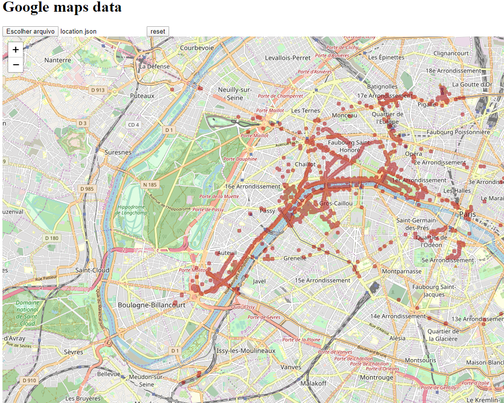

# Plot your coverage map using google maps data

This is a feature that I miss from the google maps timeline (https://www.google.com/maps/timeline), that doesn't plot all of your data at once.


## How to use

Export your data from Google using the URL
https://takeout.google.com/takeout/custom/mymaps,local_actions,location_history

Extract the json file from the takeout*.zip file and
load into the site



# How it works

## Components
 - leaflet is the map engine (https://github.com/Leaflet/Leaflet)
 - openstreetmaps as map tiles server (https://wiki.openstreetmap.org/wiki/Slippy_map_tilenames)
 - leaflet-maskcanvas responsible to draw the coverage map (https://github.com/domoritz/leaflet-maskcanvas)

Google maps data format

```json
{
  "locations" : [ {
    ...
    "latitudeE7" : 533455708,
    "longitudeE7" : -62638089,
    ...
  }
  ...
}
```

How to converte latitudeE7, longitudeE7 to latitude, longitude
```javascript
if (latitudeE7 > 900000000)
    latitudeE7 = latitudeE7 - 4294967296;
if (longitudeE7 > 1800000000)
    longitudeE7 = longitudeE7 - 4294967296;
latitudeE7 /= 1e7;
longitudeE7 /= 1e7;
```

# Functionalities
- Restrict the coverage area by clicking in 4 points on the screen.